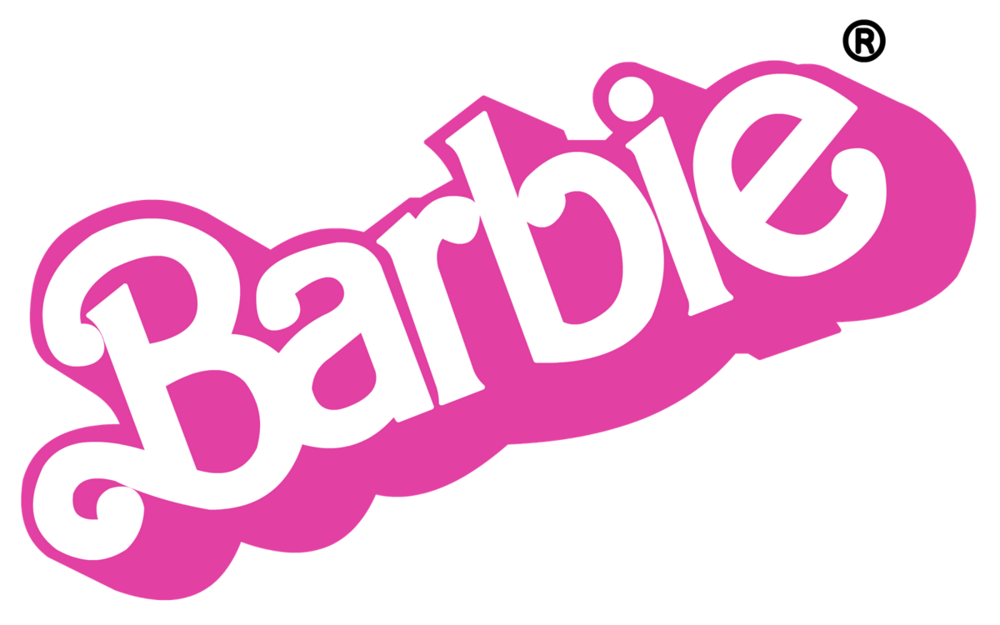

# CursoR_markdown

En este reposiotio se almacena el codigo y los archivos del curso de R markdown.

Aquí va mi siquiente párrafo Este es el tercer parrafo

Para hacer un enter son dos enter\
Este es el quinto parrafo sin espacio

Los profesores del New Dimensions son:

-   Diana
-   Alex
-   Zulema
-   Christian
-   Denisse

Esta **palabra** esta en negrita. Esta es otra forma de poner **negrita**

La **cursiva**, en con un solo asterisco.

Necesito tres asteriscos ***para que este en negrita y vursiva a la vez***

#Insetamos una imagen 

